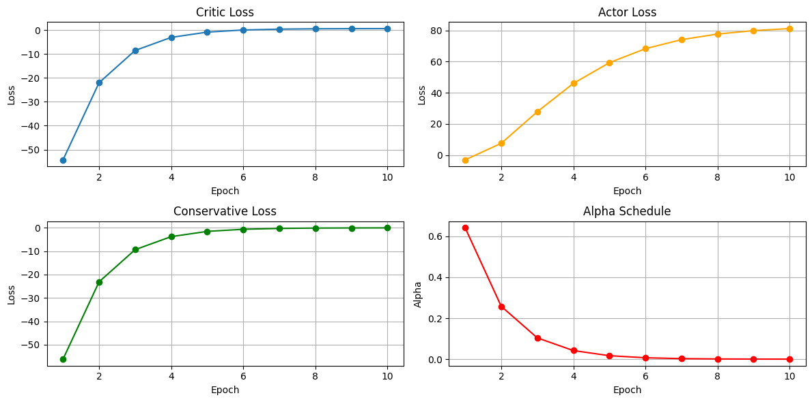
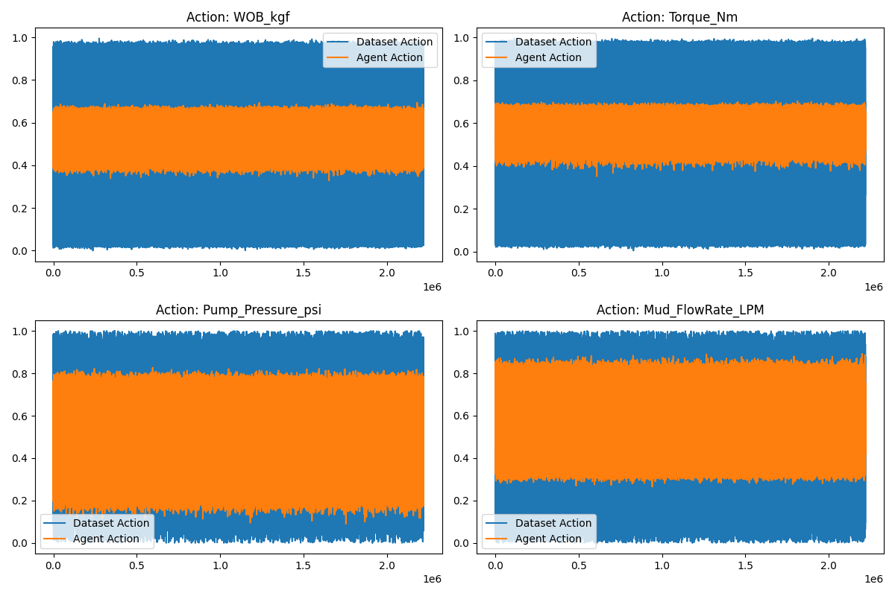
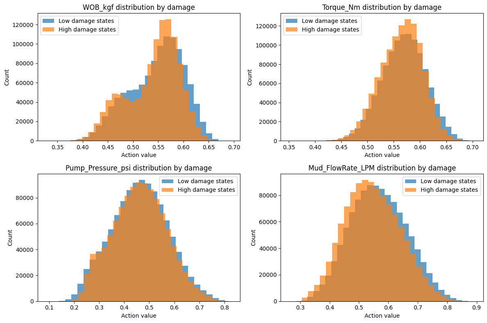

# Dataset Description

Notes for consideration before modeling:
* There are some outliers
* Most columns have missing values
* Numerical features are not scaled
* There are 33 columns with these types:
  * One column is datetime
  * 4 columns are categorical (`Shale_Reactiveness`, `WELL_ID`, `Bit_Type`, `Formation_Type`)
  * 28 columns are numerical

| Column Name                  | Description                                                                  |
|------------------------------|------------------------------------------------------------------------------|
| `Depth_m`                    | Measured depth in meters                                                     |
| `ROP_mph`                    | Rate of Penetration in meters per hour                                       |
| `WOB_kgf`                    | Weight on Bit in kilogram-force                                              |
| `Torque_Nm`                  | Applied torque in Newton-meters                                              |
| `Pump_Pressure_psi`          | Pump pressure in pounds per square inch                                      |
| `Mud_FlowRate_LPM`           | Mud flow rate in liters per minute                                           |
| `MWD_Vibration_g`            | Vibration measured while drilling, in g-force                                |
| `Bit_Type`                   | Type of drill bit (`PDC`, `Tricone`, `Diamond`)                              |
| `Mud_Weight_ppg`             | Drilling mud weight in pounds per gallon                                     |
| `Viscosity_cP`               | Mud viscosity in centipoise                                                  |
| `Plastic_Viscosity`          | Plastic viscosity, derived from overall viscosity                            |
| `Yield_Point`                | Yield point of the fluid, related to shear stress                            |
| `pH_Level`                   | Acidity/alkalinity level of the drilling fluid                               |
| `Solid_Content_%`            | Percentage of solid particles in the mud                                     |
| `Chloride_Concentration_mgL` | Concentration of chloride in the mud, milligrams per liter                   |
| `Oil_Water_Ratio`            | Ratio of oil to water in the mud (0–100 scale)                               |
| `Emulsion_Stability`         | Stability of the emulsion on a scale from 0 to 100                           |
| `Formation_Type`             | Type of rock formation (`Shale`, `Sandstone`, etc.)                          |
| `Pore_Pressure_psi`          | Estimated pore pressure in the formation, in psi                             |
| `Fracture_Gradient_ppg`      | Pressure gradient at which fractures may occur, in ppg                       |
| `Stress_Tensor_MPa`          | In-situ stress value in megapascals                                          |
| `Young_Modulus_GPa`          | Elastic modulus (Young’s modulus) of the rock in GPa                         |
| `Poisson_Ratio`              | Poisson’s ratio of the rock (unitless, typically 0.2–0.35)                   |
| `Brittleness_Index`          | Brittleness index of the rock (0 to 1 scale)                                 |
| `Shale_Reactiveness`         | Rock-fluid reactivity level (`Low`, `Medium`, `High`)                        |
| `Fluid_Loss_Risk`            | Risk index for fluid loss (0 to 1, based on viscosity and solids)            |
| `Emulsion_Risk`              | Risk index for emulsion instability (0 to 1)                                 |
| `Rock_Fluid_Reactivity`      | Numeric reactivity score (0 = Low, 0.5 = Medium, 1 = High)                   |
| `Formation_Damage_Index`     | Composite index indicating potential for formation damage (0 to ~1)          |
| `WELL_ID`                    | Unique identifier for each well (e.g. `WELL_1`)                              |
| `LAT`                        | Latitude of the well                                                         |
| `LONG`                       | Longitude of the well                                                        |
| `timestamp`                  | Timestamp of the recorded measurement (1-second resolution from Jan 1, 2023) |

# Real-Time Optimization Using Reinforcement Learning Pipeline
## First Step: Definitions
Since we are going to use offline RL and historical data, we need to define:
1. Actions
2. Reward Function
3. States

## 1. Actions
Actions are the decisions an agent make at each state to move to the next state. Choosing correct actions is important because we need variables that are **controllable**.

The following columns are selected:

| **Column Name**     | **How It's Controlled**                                                                                                                                                                                                           | **Why It Matters**                                                                                                                                                                                                                                                                                                                        |
|---------------------|-----------------------------------------------------------------------------------------------------------------------------------------------------------------------------------------------------------------------------------|-------------------------------------------------------------------------------------------------------------------------------------------------------------------------------------------------------------------------------------------------------------------------------------------------------------------------------------------|
| `WOB_kgf`           | Adjusted by changing the **hook load**, **drill string weight**, or applying **surface control settings** to alter the amount of force pressing down on the bit.                                                                  | Determines how forcefully the bit engages with the formation. Increasing WOB can raise ROP (rate of penetration), but excessive WOB may cause downhole vibration, tool failures, or inefficient cutting. The optimal WOB balances aggressiveness with tool longevity.                                                                     |
| `Torque_Nm`         | Controlled through the **top drive** or **rotary table** systems that spin the drill string. Operators can regulate torque by setting **RPM** and torque limiters or by adjusting drilling fluid characteristics.                 | Influences the efficiency of bit rotation and rock cutting. Unstable or excessive torque can lead to **stick-slip**, **bit whirl**, or **equipment fatigue**. Controlling torque ensures smoother drilling and reduces mechanical failures.                                                                                               |
| `Pump_Pressure_psi` | Set by the **mud pump system**, where operators control **pump speed**, **nozzle restrictions**, or **backpressure** to generate desired pressure levels. Real-time pressure control is essential to maintain downhole stability. | Regulates the **hydraulic force** applied to clean the bit, transport cuttings, and balance formation pressures. Low pressure may cause inadequate hole cleaning, while high pressure risks **fracturing the formation**, leading to **lost circulation** or well control issues.                                                         |
| `Mud_FlowRate_LPM`  | Adjusted by controlling **mud pump output rate** through surface equipment. Flow rate changes are often coordinated with changes in pump pressure and bit hydraulics.                                                             | Crucial for **cuttings transport**, **cooling the bit**, and maintaining **equilibrium pressure** in the borehole. A high flow rate improves cleaning but increases surface load and pressure. A low flow rate may lead to poor cleaning, stuck pipe, or hole collapse. Finding the optimal rate improves drilling efficiency and safety. |

## 2. Reward Function
The reward is the result of choosing an action. The reward function needs to be defined to **increase safety** and **the efficiency**.

For efficiency and production, higher `ROP_mph` indicates faster drilling; hence, more efficiency. For safety, lower `Formation_Damage_Index` indicates less damage; hence, more safety.

So the reward function is defined as:

Reward = α * ROP_mph - β * Formation_Damage_Index

Where α and β are tunable weights that are chosen depending on what we care about more:
* Increase α for more efficiency and speed
* Increase β for more safety
* Set α = β for balance

**NOTE:** features must be scaled before modeling

## 3. States
States represent what the agent “sees” at each decision step `t` to pick its actions effectively. Considerations for this part:
* Reward-related columns must be included because they reflect current performance and risk
* Current timestep actions must be excluded because they are what the agent chooses
* previous actions (from timestep `t - 1`) must be included to help the agent understand system dynamics 

### State Vector At Timestep `t`
| Feature Name               | Time Reference | Description                                          |
|----------------------------|----------------|------------------------------------------------------|
| `Depth_m`                  | t              | Current drilling depth                               |
| `ROP_mph`                  | t              | Rate of Penetration (drilling speed)                 |
| `MWD_Vibration_g`          | t              | Vibration measured during drilling                   |
| `Formation_Type` (encoded) | t              | Type of rock formation (e.g. shale, sandstone, etc.) |
| `Pore_Pressure_psi`        | t              | Pore pressure of the formation                       |
| `Mud_Weight_ppg`           | t              | Mud density                                          |
| `Viscosity_cP`             | t              | Mud viscosity                                        |
| `Fluid_Loss_Risk`          | t              | Risk index for fluid loss                            |
| `Emulsion_Risk`            | t              | Risk index for emulsion instability                  |
| `Formation_Damage_Index`   | t              | Composite indicator of potential formation damage    |
| `WOB_kgf`                  | t-1            | Previous step's Weight on Bit                        |
| `Torque_Nm`                | t-1            | Previous step's applied torque                       |
| `Pump_Pressure_psi`        | t-1            | Previous step's pump pressure                        |
| `Mud_FlowRate_LPM`         | t-1            | Previous step's mud flow rate                        |

## Second Step: Data Preprocessing
Pipeline for preprocessing the data before creating the model:
1. Loading the dataset
2. Extracting features (in the table above)
3. Removing outliers (IQR method)
4. Handling missing values
5. Encoding `Formation_Type`
6. Normalizing numerical features
7. Adding previous timestep actions (`t - 1`)
8. Saving to output directory

All preprocessing steps are implemented in the `rl_data_preprocessor.py` located in the `Scripts\real-time optimization` directory.

## Third Step: Building The Model
Since the actions are continuous features, using methods such as DQN is not possible.
Therefore, a model that works well with continuous actions and is designed for offline tasks, such as **CQL**, is required.

Pipeline for training the model:
1. Loading the preprocessed dataset
2. Extracting states and actions
3. Creating reward function
4. Preparing model requirements (timeouts and terminals)
5. Splitting the dataset into train and test
6. Initializing CLQ model
7. Training the model with different steps
8. Saving the final model

All implementations are available in the `offline_rl_agent.py` script.
## Forth Step: Evaluation
Firstly, we load the model and use it to predict actions on the testing sample.
Then, to evaluate the model, a variety of methods are used because we cannot judge the agent by just one metric. (Implemented in the `rl_agent_evaluation.py` script)

### 1. Loss Analysis
According to the charts below:
* `Critic loss` and `Conservative loss` started large negative and increased toward 0 
* `Critic loss` and `Conservative loss` behaviors were expected and stable
* `Actor loss` behaved contrary to the other losses and increased steadily which is typical in offline RL (since it’s maximizing Q-values)
* `Alpha` decayed during training to almost 0.00018, meaning that the policy converged

**Is the model good?** Cannot say. At this stage, we only know that the model was trained stably and converged.

### 2. MSE Analysis
The mean squared error between the predicted actions the actual actions in the testing sample is `0.0344`.
This means that the learned policy outputs actions that are close but not identical to the actions taken in the original dataset.
In simple words, the model is not suffering from overfitting and is not copying the data, it has learned something.

**Is the model good?** Cannot say. At this stage, we only know that the model did not overfit to the training set and
converged stably. We need to analyze the reward and actions.

### 3. Reward Analysis
The average predicted reward by the agent is equal to the actual average reward. This means that the model
is producing actions that match the dataset performance. Now we can say that the model is good enough but further analysis is required.

### 4. Action Comparison
According to the charts below (that show the distribution of actual actions and the predicted actions):
* The agent actions (orange) are much more concentrated around the center of the distribution, meaning that the policy has learned safe and consistent
* For all actions, the agent avoids extremes (very low or very high values) seen in the dataset

Overall, the agent outputs actions in a stable, narrower range than the dataset’s broader distribution, indicating conservative,
consistent decision-making while respecting the offline data distribution. This behavior is desirable if safety is the top priority.

In conclusion, the agent is actually good, safe and stable.

## Fifth Step: Agent Decision Analysis
The plots below, visualize how the trained CQL policy's predicted actions vary between low-damage and high-damage
operational states. The policy reacts differently to varying formation damage levels.

Blue (🟦) bars = the agent’s predicted actions values when formation damage is low

Orange (🟧) bars = the agent’s predicted actions values when formation damage is high

According to the charts:
1. Pump Pressure
    * Nearly identical distributions for low and high damage, indicating that the agent does not really change pump pressure based on damage level.
    * Pump Pressure may not be a strong factor in the damage reduction.

2. Mud Flow Rate
    * High-damage states have a higher peak, meaning that the agent might be trying to control flow rate a little more when damage is high, but it’s not a big change.
    * Mud Flow Rate may not be a strong factor in the damage reduction, but it is stronger than the Pump Pressure

3. WOB 
    * In high-damage states, the agent prefers lower and more consistent WOB, showing that the agent becomes more careful with WOB when there's more damage risk.
    * WOB is an important factor in damage reduction.

4. Torque
    * In high-damage states, the agent prefers medium torque, less extreme.
    * Torque is also an important factor but not as strong as WOB.

**The same can be applied for `ROP` feature.**

